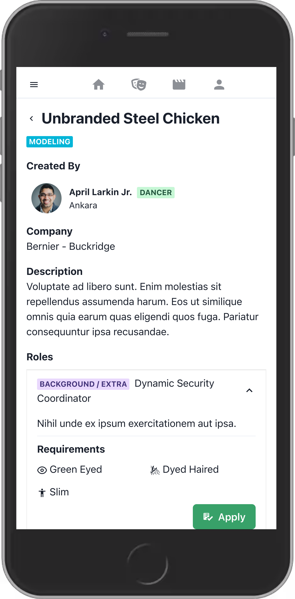

  

# Client

Run client server: `cd client && yarn start`

Starts on `http://localhost:3000`

[Chakra UI Docs](https://next.chakra-ui.com/docs/getting-started)

# Server
Requirements:
* [Docker](https://www.docker.com/get-started)
  
To run the GraphQL API: `cd server && docker-compose up`

Hasura Console: `http://localhost:8000`
Adminer Console: `http://localhost:8090`

## Database
`yarn migrate`: Initializes DB tables.

`yarn rollback`: Reverts latest migration.

`yarn seed`: Add initial data to DB.

`yarn hard_reset`: Clean DB and create it with fresh data.

`yarn dev`: Required only for sign-up / sign-in

**Migrations**: Creates DB

**Seeds**: Adds data to DB

